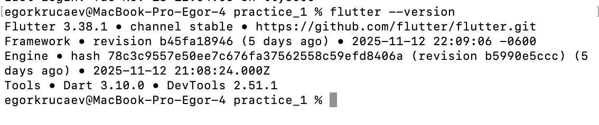
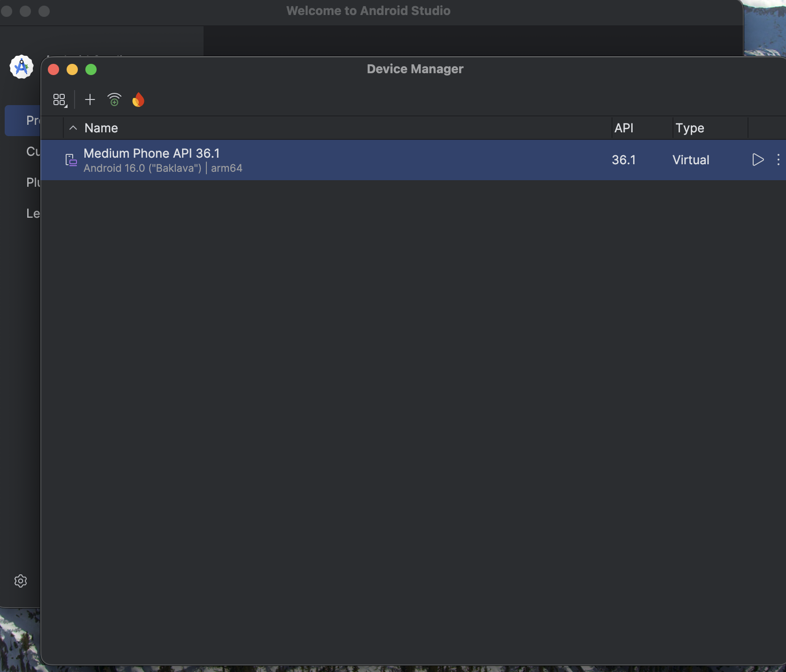
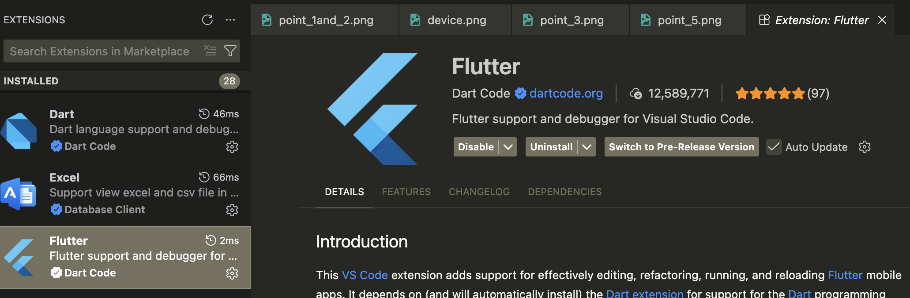
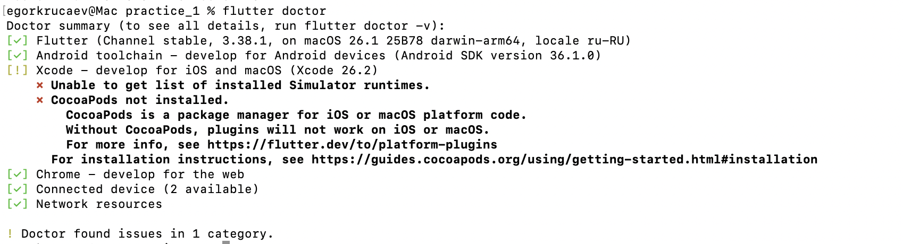
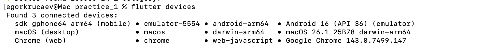
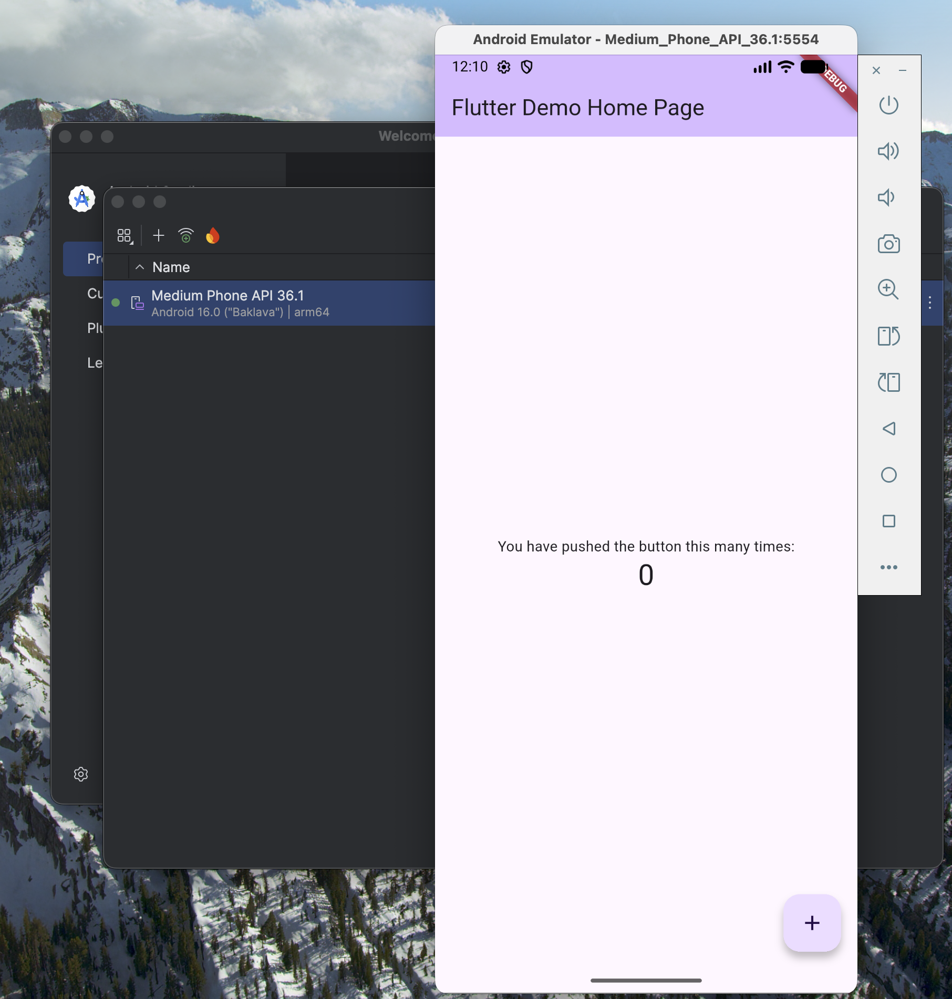
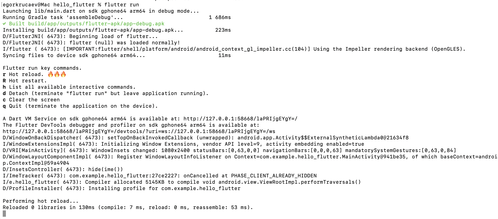
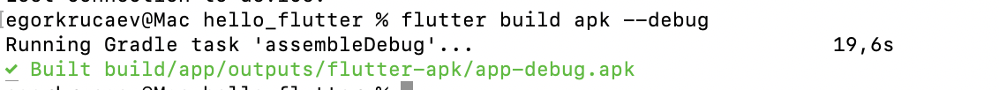

# Практическое занятие №1
**Тема:** Установка инструментария и настройка среды разработки мобильных приложений. Настройка режима терминала.

## Использованные команды
- `flutter --version` — проверка установки Flutter и версии SDK.
- `flutter doctor` — диагностика окружения и выявление проблем.
- `flutter doctor --android-licenses` — принятие Android-лицензий.
- `flutter devices` — список доступных устройств.
- `flutter create hello_flutter` — создание нового проекта.
- `flutter run` — запуск приложения на устройстве/эмуляторе.
- `flutter build apk --debug` / `flutter build apk --release` — сборка APK.

## Чек-лист выполнения
- Flutter установлен и доступен из терминала.
- Android SDK и эмулятор настроены и запускаются.
- VS Code распознает Flutter/Dart и запускает проект.
- `flutter doctor` завершился без критических ошибок.
- Устройство отображается в `flutter devices`.
- Приложение запускается, hot reload работает.
- APK успешно собран.

## Контрольные точки (скриншоты)

### Контрольная точка 1 — терминал готов, виртуализация доступна

### Контрольная точка 2 — `flutter --version` без ошибок

### Контрольная точка 3 — в AVD Manager создано виртуальное устройство

### Контрольная точка 4 — активны расширения Flutter/Dart

### Контрольная точка 5 — `flutter doctor` без критических ошибок

### Контрольная точка 6 — `flutter devices` показывает устройство

### Контрольная точка 7 — приложение `hello_flutter` запущено

### Контрольная точка 7 (доп.) — работа через терминал, hot reload

### Контрольная точка 8 — сборка APK завершена успешно

## Результаты
- Окружение Flutter успешно установлено и проверено.
- Android Studio настроена как поставщик SDK/эмулятора.
- VS Code готов к разработке Flutter-приложений.
- Проект `hello_flutter` создан и запущен, hot reload работает.
- APK собран успешно.

## Проблемы и решения (кратко)
1. **Предупреждение о лицензиях Android.** Решение: выполнена команда `flutter doctor --android-licenses` и подтверждены лицензии.
2. **Устройство не отображалось в `flutter devices` до запуска эмулятора.** Решение: запущен AVD через Android Studio.
3. **Необходимость установить системный образ для AVD.** Решение: загружен актуальный System Image через SDK Manager.

## Вывод
В ходе практической работы настроена полноценная среда разработки Flutter на macOS: установлены SDK, IDE и эмулятор, проверено окружение, создано и запущено первое приложение, выполнена сборка APK. Получены базовые навыки работы с инструментарием Flutter и терминалом.
