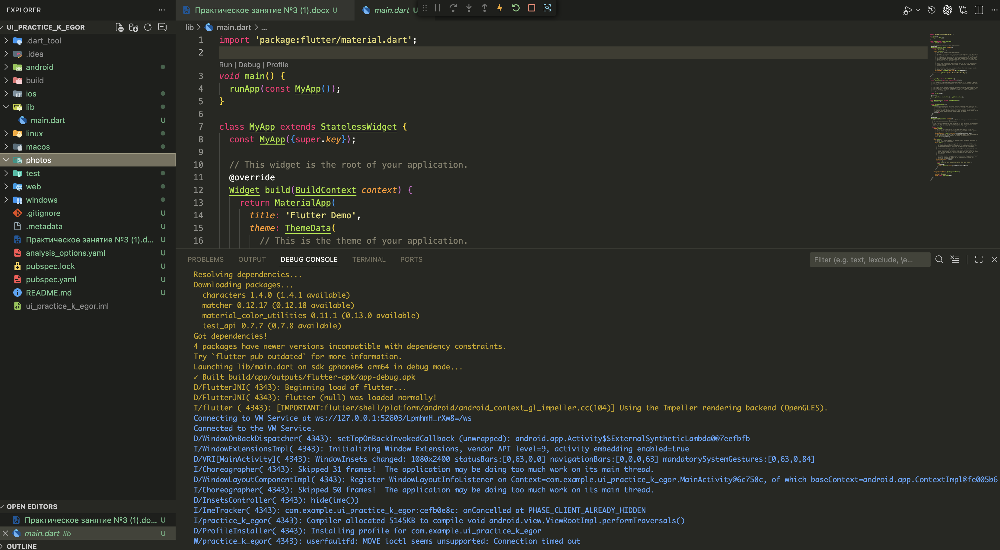
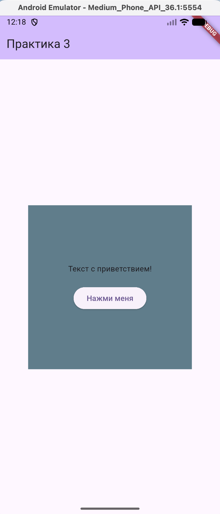
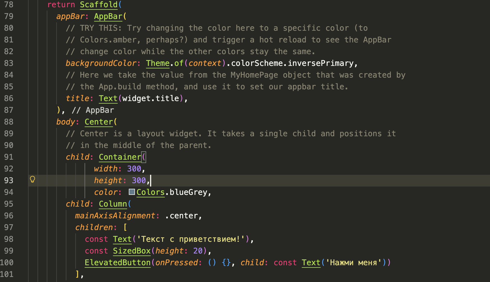
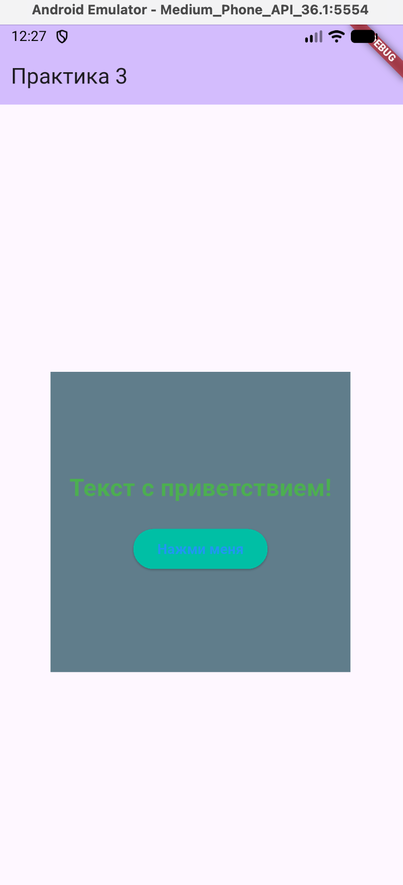
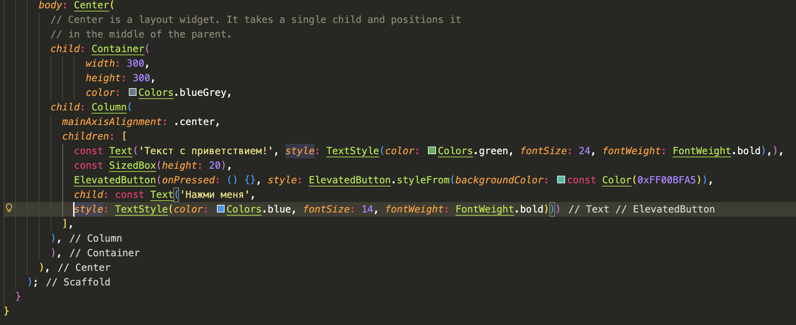
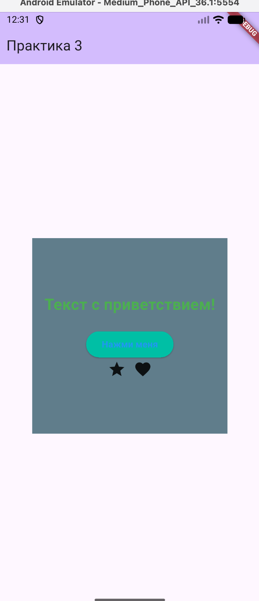
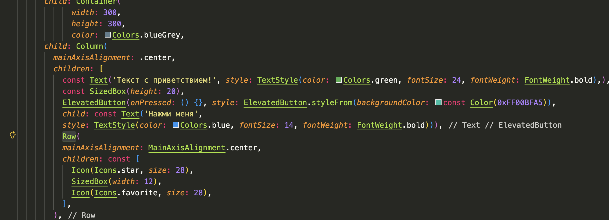

# Практическое занятие №3

## Краткое описание выполненной работы
В проекте `ui_practice_k_egor` в файле `lib/main.dart` реализован экран с заголовком «Практика 3». Внутри `Scaffold` размещены базовые элементы интерфейса: текст, кнопка и контейнер, а также компоновка через `Column` и `Row`. Дополнительно заданы пользовательские цвета и параметры текста.

## Использованные виджеты
- `MaterialApp`, `Scaffold`, `AppBar` — каркас приложения и экран.
- `Center`, `Container` — центровка и область с заданными размерами.
- `Column`, `Row` — вертикальная и горизонтальная компоновка.
- `Text`, `ElevatedButton`, `Icon`, `SizedBox` — основные элементы интерфейса и отступы.

## Как менялись стили и цвета
- Цвета элементов заданы через стандартные константы: `Colors.blueGrey`, `Colors.green`, `Colors.blue`.
- Кастомный цвет кнопки задан через `Color(0xFF00BFA5)`.
- Тексту задан стиль: `fontSize: 24`, `fontWeight: FontWeight.bold`, цвет `Colors.green`.
- Для текста кнопки задан стиль: `fontSize: 14`, `fontWeight: FontWeight.bold`, цвет `Colors.blue`.
- Размеры контейнера заданы явно: `width: 300`, `height: 300`.

## Трудности
Существенных трудностей не возникло. Потребовалось внимательно следить за компоновкой элементов и отступами, чтобы `Row` и `Column` выглядели аккуратно.

## Контрольные точки (скриншоты)
### Контрольная точка 1: проект создан и запускается

### Контрольная точка 2: есть текст, кнопка и контейнер

### Контрольная точка 3: применены стили и цвета

### Контрольная точка 4: добавлена компоновка элементов в Row и Column

